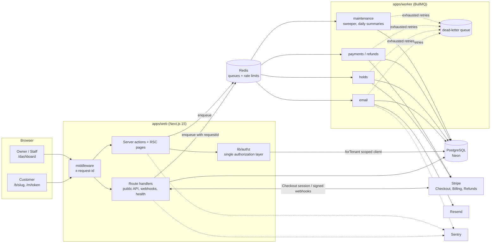
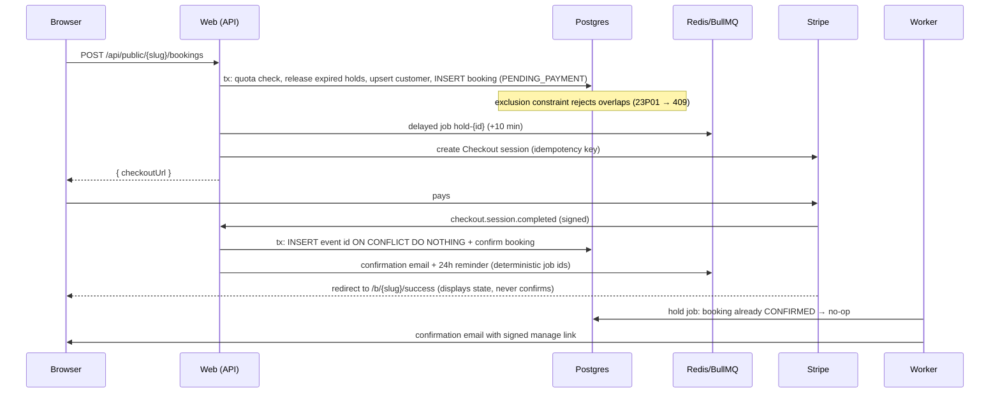

# SlotKeep

Multi-tenant appointment booking for small service businesses (salons, tutors, trainers,
clinics). Each business gets a workspace and a public booking page at `/b/<slug>`. Customers
pick a service, a staff member (or "anyone"), and a time, then pay a deposit through Stripe
Checkout. Owners run their day from a dashboard: calendar, bookings, refunds, staff hours,
plan and analytics.

The project prioritises correctness, tests and observability over feature count. Every number in
this README comes from an actual run. The environment and the date of each run are stated next
to it.

> **Live demo:** not deployed yet. Deploying needs Vercel, Neon and Render accounts plus Stripe
> and Resend keys, which this repository doesn't hold. Everything is ready for it: see
> [Deployment](#deployment). To try it locally in one command, see
> [Quick start (Docker)](#quick-start-docker). The demo accounts are listed under
> [Demo accounts](#demo-accounts).

---

## Contents

- [Features](#features)
- [Architecture](#architecture)
- [Key design decisions and tradeoffs](#key-design-decisions-and-tradeoffs)
- [Running locally](#running-locally)
- [Testing](#testing)
- [Measured results (k6, Lighthouse)](#measured-results)
- [Observability](#observability)
- [Deployment](#deployment)
- [Known limitations and next steps](#known-limitations-and-next-steps)

## Features

| Area                      | What's implemented                                                                                                                                                                          |
| ------------------------- | ------------------------------------------------------------------------------------------------------------------------------------------------------------------------------------------- |
| Onboarding                | Magic-link sign-up (Auth.js), optional Google OAuth, create a business (name, slug, timezone, brand color); a setup checklist guides adding services and staff hours.                       |
| Availability engine       | Pure, deterministic slot computation from weekly hours, time off, existing bookings and buffers. DST-safe (`packages/core`).                                                                |
| Public booking page       | `/b/[slug]`: service → staff or "anyone" → date → slot → details → Stripe Checkout. Shared zod validation runs in the browser and on the server.                                            |
| Double-booking prevention | Postgres exclusion constraint on `tstzrange(startAt, blockedUntil)` per staff member, plus a 20-concurrent-request test.                                                                    |
| Slot holds                | A 10-minute `PENDING_PAYMENT` hold. A BullMQ delayed job releases it and expires the Stripe session. A minutely sweeper is the safety net.                                                  |
| Stripe                    | Checkout for deposits, Billing for the Pro subscription, signature-verified idempotent webhooks. Bookings are confirmed **only** by the webhook.                                            |
| Background jobs           | Confirmation, 24h reminder, reschedule and cancellation emails; hold expiry; refunds; a 07:00-local daily summary to owners. 5 attempts with exponential backoff, then a dead-letter queue. |
| Owner dashboard           | Day and week calendar, booking list with filters and search, mark completed or no-show, cancel with automatic Stripe refund.                                                                |
| Customer self-service     | HMAC-signed, expiring link in every email to cancel (refund policy applied) or reschedule. Old links are revoked on change.                                                                 |
| Plans                     | Free: 1 active staff member and 50 bookings a month, enforced server-side and race-free. Pro via Stripe Billing, with a billing portal.                                                     |
| Analytics                 | Bookings and net deposit revenue per week (12 weeks), completed service value, no-show rate.                                                                                                |
| Roles                     | `OWNER` and `STAFF` per tenant, checked in one authorization layer.                                                                                                                         |

## Architecture



Booking with a deposit, end to end:



### Repository layout

```
apps/
  web/        Next.js 15 App Router: pages, server actions, route handlers, Auth.js, Playwright e2e
  worker/     BullMQ worker: email, holds, refunds, maintenance, DLQ, health endpoint
packages/
  core/       Pure domain logic, no I/O: availability engine, time, pricing, plan limits,
              signed tokens, analytics, shared zod schemas
  db/         Prisma schema + versioned migrations (incl. hand-written constraints),
              tenant-scoped client, booking service, seed
  infra/      Env validation, pino logger, Redis, queue definitions, mailer + templates,
              Stripe and fake payment gateways, Redis rate limiter
docs/adr/     Architecture decision records
docs/perf/    Raw Lighthouse and k6 summaries behind the tables below
loadtest/     k6 scripts
```

## Key design decisions and tradeoffs

Full write-ups for the first three are in [`docs/adr`](docs/adr).

### 1. Double-booking: exclusion constraint, not application locks ([ADR 0001](docs/adr/0001-double-booking-exclusion-constraint.md))

```sql
ALTER TABLE "Booking" ADD CONSTRAINT "booking_no_overlap"
  EXCLUDE USING gist ("staffId" WITH =, tstzrange("startAt", "blockedUntil", '[)') WITH &&)
  WHERE ("status" IN ('PENDING_PAYMENT', 'CONFIRMED', 'COMPLETED', 'NO_SHOW'));
```

- The invariant lives in the data, so no code path can forget it: not reschedule, not a script,
  not a future feature. `SELECT ... FOR UPDATE` would have worked too, but only for callers that
  remember to take the lock.
- `blockedUntil = endAt + buffer` means buffers are protected. Half-open `[)` ranges allow
  back-to-back bookings.
- Holds are ordinary `PENDING_PAYMENT` rows, so they reserve the slot through the same constraint.
- Tradeoff: under heavy contention a conflicting insert waits for the competing transaction
  before failing (contended booking p50 239 ms vs 28 ms uncontended in the k6 runs below).
- The free-plan quota (50/month) is not a range conflict, so it uses a per-tenant
  `pg_advisory_xact_lock`, taken **only for capped tenants**. Paid tenants never serialize.

### 2. Webhooks: confirm only from Stripe, idempotent in one transaction ([ADR 0002](docs/adr/0002-stripe-webhooks-idempotency.md))

- The success redirect never confirms anything. It can be forged or arrive before the payment
  settles, so the page polls the booking's state until the webhook lands.
- `INSERT INTO "ProcessedWebhookEvent" ... ON CONFLICT DO NOTHING RETURNING id` runs in the same
  transaction as the effects. Redeliveries, including concurrent ones, are no-ops. A failure rolls
  back the event row, so Stripe's retry starts clean.
- Emails and refunds are enqueued just before commit with deterministic job ids, and consumed by
  state-checking, idempotent workers. That gives effectively-once behaviour without a
  transactional outbox table. The tradeoff: every consumer must re-check state; enforced by tests.
- Stripe Checkout sessions live at least 30 minutes, longer than our 10-minute hold, so the hold
  job expires the session. A payment that still arrives late re-confirms the booking if the slot
  is free, or refunds in full and apologises if it isn't.
- Subscription events can arrive out of order: `Tenant.billingEventAt` rejects stale ones.

### 3. Time: UTC instants plus wall-clock schedules ([ADR 0003](docs/adr/0003-time-handling.md))

- Bookings and time off are `timestamptz` UTC. Weekly hours are stored as wall-clock minutes and
  interpreted in the tenant's IANA timezone.
- The availability engine is a pure function: no clock, no I/O. `now` is a parameter, which is
  what makes the DST tests possible.
- Nonexistent local times (spring forward) clamp to the moment clocks jump. A unit test caught a
  real bug here: Luxon's default normalisation had moved a window lying inside the gap an hour
  later.

### 4. Tenant isolation: a scoped Prisma client plus composite foreign keys

- `forTenant(tenantId)` returns a Prisma client extension that forces `tenantId` into every
  filter (reads, updates, deletes, counts, aggregates) and every create on tenant-owned models.
  It rejects writes that name another tenant, or that use a `tenant: { connect }` relation.
- Child tables reference parents through **composite foreign keys** `(tenantId, id)`. A booking
  can't point at another tenant's staff, service or customer even through the unscoped client,
  and nested reads through relations can't cross tenants.
- Non-members get **404, not 403**, so slugs and ids don't leak.
- Tradeoff: Postgres row-level security would add defence in depth at the connection level, but
  it needs per-request `SET` statements, which fit poorly with pooled serverless connections. The
  isolation suite (below) tests the application-level guarantee directly.

### 5. One authorization layer

`apps/web/lib/authz.ts` holds a permission matrix (`booking:read`, `booking:cancel`,
`catalog:manage`, ...). Every page, server action and service call goes through
`requireTenant(slug, permission)`, which returns `{ user, tenant, role, plan, db }` with `db`
already tenant-scoped. Components never decide access; at most they hide buttons with `can()`.

### 6. Smaller decisions

- **Money is integer cents** end to end. `parseMoneyToCents("0.29") === 29` (the float route
  gives `28.999...`). Deposits are snapshotted on the booking, so later price edits don't
  rewrite history.
- **Rate limiting** is a Redis sliding-window log, run as one atomic Lua script. Limits per IP:
  public reads 120/min, booking creation 10/min per business, manage links 30/min, auth 30/min.
  Magic-link emails are limited to 5 per 15 min, per IP **and** per target email. It **fails
  open** if Redis is down, because the database constraints still guarantee correctness.
- **Database sessions** (Auth.js Prisma adapter) are revocable server-side, and the cookie holds
  nothing sensitive.
- **Self-service links** are stateless HMAC tokens carrying the booking's `tokenVersion`.
  Rescheduling or cancelling bumps the version, which revokes every earlier link without a token
  table. Links expire at the appointment start, capped at 30 days.
- **Fake payment gateway** for offline dev and CI. "Paying" builds a Stripe-shaped event, signs
  it with the real webhook secret, and POSTs it to the real webhook route. The verification,
  idempotency and confirmation code under test is the production code. Set
  `PAYMENTS_MODE=stripe` to use Stripe test mode.
- **Env validation** is lazy (on first use) with production guards: the app refuses to start in
  production with a `dev-` token secret, or with Stripe mode and no key.

## Running locally

### Quick start (Docker)

```bash
docker compose up --build
# web    → http://localhost:3000   (booking page: http://localhost:3000/b/shear-bliss)
# health → http://localhost:3000/api/health
```

Compose runs Postgres 16, Redis 7, a one-shot `migrate` container (migrations and seed), the web
app and the worker. It uses the payment simulator and enables demo sign-in and the dev mailbox.
**Both are local-only conveniences: never enable them on a public deployment.**

### Development (hot reload)

Prerequisites: Node 22, pnpm 10, plus Postgres 16 and Redis 7 (or
`docker compose up postgres redis`).

```bash
pnpm install                 # also runs prisma generate
cp .env.example .env         # defaults work for local dev
ln -s ../../.env apps/web/.env && ln -s ../../.env packages/db/.env
pnpm db:migrate              # prisma migrate deploy
pnpm db:seed                 # two demo tenants
pnpm dev                     # web on :3000 + worker (tsx watch)
```

Sign in at `/login`. Without `RESEND_API_KEY`, emails, including magic links, are recorded and
shown at **`/dev/mailbox`** (development only).

### Demo accounts

Seeded by `pnpm db:seed` (re-running recreates them):

| Account                 | Role  | Business                                                      |
| ----------------------- | ----- | ------------------------------------------------------------- |
| `owner@shearbliss.demo` | Owner | Shear Bliss Salon (`/b/shear-bliss`), New York, Pro, 3 staff  |
| `staff@shearbliss.demo` | Staff | Shear Bliss Salon                                             |
| `owner@brightpath.demo` | Owner | BrightPath Tutoring (`/b/brightpath`), Los Angeles, Free plan |

There are no passwords: sign in with a magic link from `/dev/mailbox`, or set
`DEMO_LOGIN_ENABLED=true` for one-click demo sign-in buttons on `/login`. Those buttons mint a
normal single-use Auth.js verification token for these three addresses only.

### Environment variables

See [`.env.example`](.env.example). The important ones:

| Variable                                                            | Purpose                                                       |
| ------------------------------------------------------------------- | ------------------------------------------------------------- |
| `DATABASE_URL`, `REDIS_URL`                                         | Postgres and Redis                                            |
| `APP_URL`                                                           | Public base URL (used in emails and Stripe redirects)         |
| `AUTH_SECRET`, `AUTH_GOOGLE_ID/SECRET`                              | Auth.js; Google is optional                                   |
| `MANAGE_TOKEN_SECRET`                                               | Signs customer self-service links                             |
| `PAYMENTS_MODE`                                                     | `fake` (simulator) or `stripe`                                |
| `STRIPE_SECRET_KEY`, `STRIPE_WEBHOOK_SECRET`, `STRIPE_PRO_PRICE_ID` | Stripe                                                        |
| `RESEND_API_KEY`, `EMAIL_FROM`                                      | Email; without a key, emails are logged                       |
| `SENTRY_DSN`, `NEXT_PUBLIC_SENTRY_DSN`, `SENTRY_RELEASE`            | Error tracking; release defaults to the platform's commit SHA |

## Testing

```bash
pnpm lint && pnpm typecheck
pnpm test:unit                 # 101 tests: core domain + email templates
pnpm test:unit:coverage        # with a ≥85% gate on packages/core
pnpm test:integration          # 83 tests, real Postgres + Redis (uses slotkeep_test, Redis db 15)
pnpm --filter @slotkeep/web build && pnpm test:e2e   # 12 Playwright tests
```

| Suite                         | Count                            | What it covers                                                                                                                                                                                                                                                                                                                                                                                                                                                                                                                                                                                                                                                                                                                                                                                                                          |
| ----------------------------- | -------------------------------- | --------------------------------------------------------------------------------------------------------------------------------------------------------------------------------------------------------------------------------------------------------------------------------------------------------------------------------------------------------------------------------------------------------------------------------------------------------------------------------------------------------------------------------------------------------------------------------------------------------------------------------------------------------------------------------------------------------------------------------------------------------------------------------------------------------------------------------------- |
| Unit (`packages/*/test`)      | 101                              | Availability engine (50 tests: DST in New York, London and Lord Howe; Kolkata +5:30; overlapping and unsorted bookings; buffers at day edges; time off; lead time; "any staff" merging), time helpers, pricing and refund policy, plan limits, signed tokens, analytics, zod schemas, status machine, email escaping.                                                                                                                                                                                                                                                                                                                                                                                                                                                                                                                   |
| Coverage, `packages/core`     | **100% lines / 98.55% branches** | `packages/core` holds this monorepo's pure domain logic (the `lib/` of the spec); CI fails below 85%.                                                                                                                                                                                                                                                                                                                                                                                                                                                                                                                                                                                                                                                                                                                                   |
| Integration (`*.int.test.ts`) | 83                               | **20 simultaneous bookings for one slot → exactly 1 succeeds** (and 3 staff with "any" → exactly 3, on distinct staff). Raw-SQL overlap rejection. Hold expiry, the lazy release and the sweeper. Late payment reinstated vs conflict. Free-plan quota under concurrency (49 used + 5 concurrent → 1 succeeds). Staff limit. A **tenant isolation suite** that tries to read, update, delete, create, upsert and cross-link another tenant's data at the client, service and authz layers. Webhook signature, idempotency and concurrent duplicates. Out-of-order subscription events. Public API validation, 404s and the 429 rate limit with `Retry-After`. Self-service token forgery, expiry and revocation. Worker processors, the DLQ, and a real BullMQ worker showing 100/200/400 ms exponential backoff before dead-lettering. |
| E2E (Playwright, prod build)  | 12                               | Full booking: pick slot → validation → hold → pay → webhook → "You're booked!" → worker email. The slot disappears for the next customer. The self-service link. **Owner cancel → $15.00 refund through the payment gateway (recorded with its refund id) → cancellation email.** Staff role restrictions. Cross-tenant dashboard → 404. Onboarding, server-side pricing validation, free-plan staff limit → upgrade to Pro → limit lifted. Reschedule from email → old link revoked. An axe-core WCAG 2 A/AA scan of the booking page (no serious or critical violations).                                                                                                                                                                                                                                                             |

E2E uses the payment simulator by default. Setting `STRIPE_E2E=1` with test-mode keys (plus
`stripe listen --forward-to localhost:3100/api/webhooks/stripe`) drives Stripe's real hosted
Checkout with the `4242` test card instead. **That path is written but has not been run here**,
because no Stripe keys were available. The CI workflow enables it automatically when the
`STRIPE_E2E_SECRET_KEY` secret exists.

### CI

`.github/workflows/ci.yml` runs on every PR: lint plus Prettier, typecheck, unit tests with the
coverage gate, integration tests (Postgres and Redis service containers), Playwright e2e, and a
Docker build of both images. `preview.yml` deploys a Vercel preview per PR when `VERCEL_TOKEN` is
configured (or use the Vercel GitHub app). **To block merges on failure**, enable branch
protection on `main` with these checks marked as required (GitHub → Settings → Branches); that
setting lives in the repository, not in the workflow.

## Measured results

### k6 load tests

Recorded 2026-10-02 with k6 v1.3.0. **Environment:** one 4 vCPU / 15 GB cloud container running
_everything at once_: k6, the Next.js production server (a single Node process), the worker,
PostgreSQL 16 and Redis 7. Fake payment gateway. Rate limiting disabled for these runs, since all
traffic comes from one IP. Treat the numbers as a lower bound for one app instance; production
would split these onto separate machines. Raw summaries:
[`docs/perf/k6-summary.json`](docs/perf/k6-summary.json).

| Scenario (script)                     | Load                            | Requests     | Throughput | p50      | p95      | p99      | Error rate |
| ------------------------------------- | ------------------------------- | ------------ | ---------- | -------- | -------- | -------- | ---------- |
| Slot availability (`availability.js`) | 5 VUs, 35 s                     | 6,831        | 195 req/s  | 23.2 ms  | 33.0 ms  | 38.7 ms  | 0.00%      |
| Slot availability (`availability.js`) | ramp to 50 VUs, 85 s            | 17,955       | 211 req/s  | 217.1 ms | 274.8 ms | 303.3 ms | 0.00%      |
| Booking creation (`booking.js`)       | 10 iterations/s, 60 s           | 454 bookings | —          | 28.0 ms  | 34.8 ms  | 43.0 ms  | 0.00%      |
| Booking contention (`contention.js`)  | 30 VUs racing for one day, 20 s | 246 POSTs    | —          | 239.4 ms | 371.8 ms | 386.1 ms | 0.00%      |

How to read these:

- **Availability** saturates at about 200 req/s for the single Node process: throughput is the
  same at 5 and 50 VUs, so the higher latency at 50 VUs is queueing, not slower queries.
- **Booking** latencies cover only `POST /bookings` (each iteration also does one availability
  GET first). Of 601 iterations, 147 found no open slot on the randomly chosen day (Sundays and
  days that filled up) and didn't POST. All 454 POSTs succeeded.
- **Contention**: 13 bookings were created, exactly the capacity of that Saturday for the three
  stylists, and 233 attempts got the correct `409 SLOT_UNAVAILABLE`. **0 errors.** A SQL check
  afterwards found **0** overlapping active bookings for any staff member across the whole
  database.

Reproduce:

```bash
k6 run -e BASE_URL=http://localhost:3000 -e SERVICE_ID=<service id> loadtest/availability.js
k6 run -e BASE_URL=http://localhost:3000 -e SERVICE_ID=<service id> loadtest/booking.js
k6 run -e BASE_URL=http://localhost:3000 -e SERVICE_ID=<service id> -e DAY=YYYY-MM-DD loadtest/contention.js
```

### Lighthouse: public booking page (`/b/shear-bliss`)

Lighthouse 12.8.2 against the production build on the same container, 2026-10-02.
Raw: [`docs/perf/lighthouse-booking-page.json`](docs/perf/lighthouse-booking-page.json).

| Form factor                 | Performance | Accessibility | Best practices | SEO | LCP   | TBT   | CLS |
| --------------------------- | ----------- | ------------- | -------------- | --- | ----- | ----- | --- |
| Mobile (default throttling) | 99          | 100           | 100            | 100 | 2.1 s | 70 ms | 0   |
| Desktop                     | 100         | 100           | 100            | 100 | 0.5 s | 0 ms  | 0   |

Accessibility work behind those scores: a skip link, labelled controls, `aria-invalid` and
described-by errors, radiogroups for date and slot pickers, `aria-live` for slot loading, visible
focus rings, reduced-motion support, and a screen-reader table behind each analytics chart.

## Observability

- **Sentry** on web (server, edge, client via `instrumentation*.ts`) and the worker
  (`@sentry/node`), enabled by `SENTRY_DSN`. The release is `SENTRY_RELEASE`, falling back to the
  Vercel, Railway or Render commit SHA. CI creates the Sentry release and associates commits on
  `main` (when `SENTRY_AUTH_TOKEN` is set). Source maps upload during `next build` when
  `SENTRY_AUTH_TOKEN` is present. Dead-lettered jobs are reported with their queue and payload.
- **Structured logs** (pino JSON) with a **request id** assigned in middleware, returned as
  `x-request-id`, attached to every log line of the request and **copied into every job it
  enqueues**. Worker logs carry the same `requestId`, so one id follows a booking from the HTTP
  request to the confirmation email.
- **`GET /api/health`** checks Postgres (`SELECT 1`) and Redis (`PING`) with timeouts, and
  returns 200 or 503 with per-dependency latency and the release. The worker exposes
  `GET /health` on `WORKER_HEALTH_PORT` for Render and Railway.
- Every email is recorded in `EmailLog` (status, provider id, dedupe key).

## Deployment

The target topology is web on **Vercel**, worker and Redis on **Render** (`render.yaml`
blueprint) or Railway, and Postgres on **Neon**.

1. **Neon:** create a database; use the pooled connection string for `DATABASE_URL`.
2. **Render:** "New Blueprint" from this repo. It creates the worker (Docker, `worker` target)
   and a Redis instance with `maxmemory-policy noeviction` (BullMQ requires it). The worker's
   `preDeployCommand` runs `prisma migrate deploy`, so migrations run once per deploy, never from
   Vercel preview builds.
3. **Vercel:** import the repo with root directory `apps/web` (`vercel.json` sets the install
   and build commands). Set the same env vars, with `PAYMENTS_MODE=stripe`, a real `APP_URL`,
   `AUTH_URL`, and a strong `AUTH_SECRET` and `MANAGE_TOKEN_SECRET`.
4. **Stripe:** add a webhook endpoint `https://<app>/api/webhooks/stripe` for
   `checkout.session.completed`, `checkout.session.async_payment_succeeded`,
   `checkout.session.expired` and `customer.subscription.created/updated/deleted`. Put the signing
   secret in `STRIPE_WEBHOOK_SECRET`, create a recurring Price for Pro and set
   `STRIPE_PRO_PRICE_ID`, and enable the customer billing portal.
5. **Resend:** verify a sending domain, then set `RESEND_API_KEY` and `EMAIL_FROM`.
6. Seed a public demo with `pnpm db:seed` against the production database. Only set
   `DEMO_LOGIN_ENABLED=true` if you want public one-click demo sign-in. **Never** set
   `ENABLE_DEV_MAILBOX` in production: it exposes magic links.

The Docker images were built and run with `docker compose` in development. Migrations, seed,
web, worker and health checks all passed, and a booking made through the API produced a
confirmation email from the worker container. (That build passed `NODE_IMAGE` pointing at
`node:22-bookworm`, because the build sandbox blocks Debian package mirrors; the default base
image is `node:22-bookworm-slim`.)

## Known limitations and next steps

- **No live deployment** yet (see the top of this README).
- The **real-Stripe e2e path** is implemented but has only run against the simulator here.
- Staff hours UI edits one window per day; the data model and engine support split shifts.
- Customers can reschedule only to slots with the same staff member.
- Refunds are full-deposit only; partial refunds would need a refunds table (today one refund per
  booking is recorded, idempotently).
- Postgres RLS as defence in depth, and per-tenant rate limits on the dashboard, would be next
  for a multi-tenant production rollout.
- `package.json#prisma` triggers a deprecation warning in Prisma 6.19. Moving to
  `prisma.config.ts` also requires explicit `.env` loading; left for the Prisma 7 upgrade.
